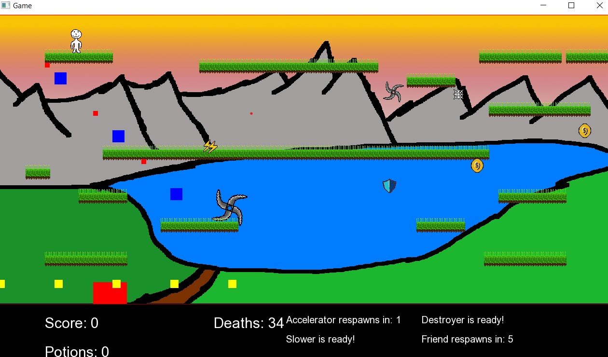

W tym repozytorium znajduje się wersja Release gry w sekcji Release z prawej strony strony głównej.

W folderze code natomiast znajdują się wszystkie pliki .h oraz .cpp, które są załączone do projektu.
Jest ich całkiem sporo, dlatego pokrótce omówię te "większe i ciekawsze" z mojego punku widzenia.

[Game.cpp](code/Game.cpp) oraz [SFML.cpp](code/SFML.cpp) - mimo, że nie są to najciekawsze pliki do przejrzenia, to właśnie tutaj wywoływane są funkcje pozwalające na granie. 
W [Game.cpp](code/Game.cpp) tworzone są obiekty różnych klas (Player, Enemy, Booster, Item...) i w funkcji składowej tej klasy Loop() wywołwane są funkcje logiczne oraz te wizualne, pozwalające wyrysować obiekty na ekranie,
w [SFML.cpp](code/SFML.cpp) natomiast tworzony jest obiekt klasy Game i wywołana funkcja Loop().

[Booster.cpp](code/Booster.cpp) - znajdują się tu funkcje dotyczące wszystkich czterech boosterów, 
* accelerator, który przyspiesza gracza oraz (z czego nie jestem do końca dumny) właśnie funkcja "accel" odpowiada za ruch gracza,
* slower - spowalniający przeciwników, 
* shield/destroyer - tworzący obwódkę wokół gracza, która niszczy wroga 
* friendly/helper przywołujący strzelającego pomocnika, który również może niszczyć wrogów.
Nad funkcjami klasy Booster spędziłem najwięcej czasu i było to dla mnie najtrudniejsze zadanie, szczególnie 
odpowiednie przekazanie i resetowanie czasów odrodzenia/czasów trwania. Nie jestem jednak dumny z wielokrotnego zagnieżdżenia w niektórych metodach tej klasy,

[Player.cpp](code/Player.cpp) - znajdują się tu funkcje dotyczące tego, co dzieje się z graczem - ruch (choć to tylko sama logika ruchu), kolizje oraz obwódka po zebraniu boostera "shield",

[Enemy.cpp](code/Enemy.cpp) - analogicznie do [Player.cpp](code/Player.cpp), głównie jest tu ruch, kolizje oraz spawn przeciwników.

Pozostałe klasy są prostsze niż te wyżej wymienione, ale jednak dla przyzwoitości również je wymienię i opiszę:

[Background.cpp](code/Background.cpp) - po prostu pobranie obrazu z pliku i funkcja wyświetlania go na ekranie,
[Coin.cpp](code/Coin.cpp) - pobranie grafik, ruch monet, wywołanie zapętlonej animacji, spawn pieniążka w losowym miejscu na planszy,
[Obstacle.cpp](code/Obstacle.cpp) - obwódka na ekranie oraz pobranie grafik platform,
[Score.cpp](code/Score.cpp) - klasa głównie zajmująca się zarządzaniem punktami.

[Inventory.cpp](code/Inventory.cpp), [Chest.cpp](code/Chest.cpp), [Item.cpp](code/Item.cpp) oraz część klasy [Score.cpp](code/Score.cpp) to moje eksperymenty nad tworzeniem i zarządzaniem ekwipunkiem, nie są to skończone klasy, ale postanowiłem ich nie usuwać, ponieważ rónież stanowią część całego projektu.

Poniżej screen z gry:
